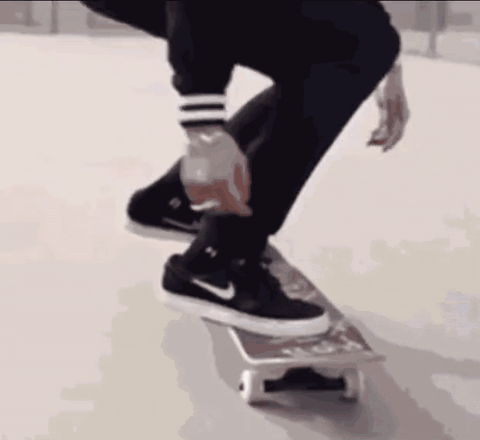

# Butterfly Twist Workshop

## Warm up
1. Upper
    1. U nod
    1. German Arm Swing
    1. Butterfly arms: upright, squatted
1. Lower
    1. horse stance sequence
    1. pike sequence
    1. SLDL
    1. open hip spin (hopping)
    1. lunge with rotation
1. Floor
    1. kneeling back leg lift
    1. cross body arch up
    1. TightArch walk

### line drills
1. butterfly kick
1. open/close positions
1. frontside/inside 360
2. butterfly kaydem, bswitch
1. spinstep
1. line axis drill
1. over block

## Relationship between Bkick and Btwist
Visualize that the **board** is your **body**.

Bkick: flatspin

Twist: Horizontal 360 Spin

Btwist: flatspin + 360 Spin 

<!-- ### similarities:

1. flipping rotation (flatspin)
    1. they should both flatspin (like a frisbee) 180degrees (halfway around)
1. timing and takeoff
    1. butterfly kick has a kick kick timing. butterfly twist has the same 2 part timing when done well. 
    1. crucial to be familiar with the timing.  
        1. beginners will use only the first timing to do everything
        1. more advanced twisters will use the first kick timing for the first half spin and the second kick timing for the second half spin -->
<!-- ### differences:

1. twisting rotation 
    1. twisting here refers to spinning (like a kickflip or rotisserie chicken) while flatspinning(like a frisbee)
    1. bkick has no twisting rotation, and btwist has one full twist
1. landing position
    1. bkick lands on your the kicking leg while btwist lands on your jumping leg -->

> **Flatspin**: spin like a frisbee
> **Twist**: spin like a rotisserie chicken

Most of our drills today aim to get your body to understand how to twist on the correct axis that allows flatspin to continue.

## Methods

### Committing to twisting shape
1. Pop 360 method
    1. hopping spin in open hip position
    1. frontside 360 in open hip position
        1. pivot to face back the way you came
    1. spin step (inside) 360 in open hip position
        1. pivot to face back the way you came
1. Pivot method
    1. hopping spin in open hip position
    1. vertical line drill + return to complete
    1. 45degree line drill + return to complete
    1. spin step 45degree line drill + return to complete
    1. vertical line jumping 360
    1. 45 degree line jump  jumping 360
    1. spin step 45degree line jump
### Bkick and Btwist specifics

#### U Dip

1. whole movement follows the arc of the dip
1. squat and a hinge
1. pivot feet as you dip (may happen in the air if you spin step)

#### Foot Position
1. plant leg forward at takeoff
1. not too wide: we'll be jumping off of both legs

#### Push and Kick
1. Follow the timing of the U dip.  The dip should help you jump
1. Both legs should push
1. Kicking leg should push into the kick
1. The purpose of the kick is to lift the hips

#### Arms
1. Follow the timing of the U dip.  Sync up with legs.
1. opposite arm: lift with kicking leg for height and twist initiation
1. same arm: reach around and to the hip for flatspin initiation and twist acceleartion
---
1. block tunnel method
    1. pay extra attention to:
        1. following your torso in the "U" dip
        1. your arms and legs staying together
        1. looking into your twist
        1. twisting up
        1. lifting your hip
    1. open hip twisting position
1. diagonal over the block method
    1. 2 hands down bkick over diagonal block
        1. focus on rhythm of the connected 2 kicks
    1. 1st hand down bkick + twist over diagonal block
        1. 2nd hand punches wide to opposite hip to spin back to complete
        1. avoid sitting up
        1. do not cross the diagonal
    1. no hands bkick + twist
        1. both arms come across wide to opposite hip to spin back to complete
        1. avoid sitting up
        1. do not cross the diagonal
    1. 
1. twisting butterfly kick up to mat (hands and knees)
1. cartwheel twist